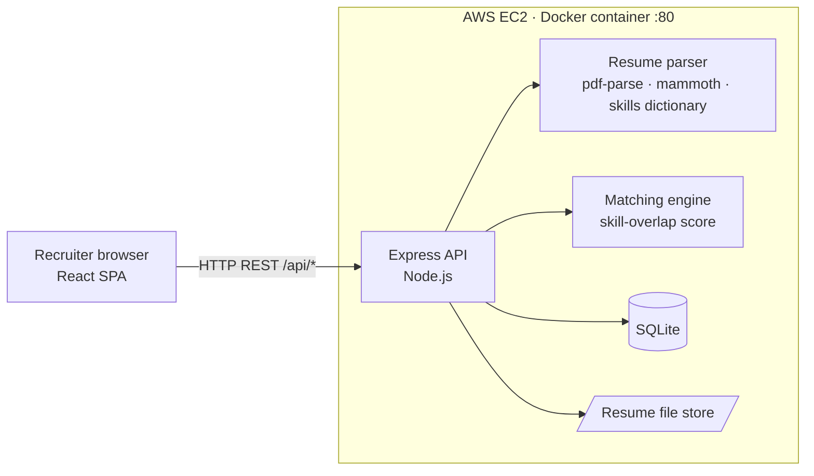
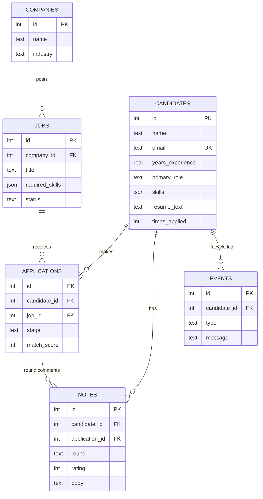
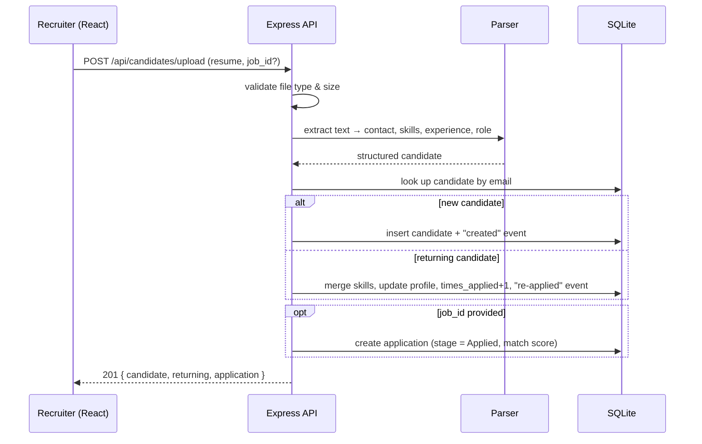
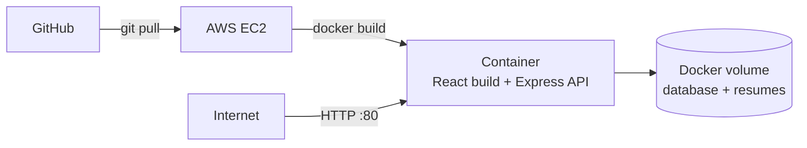

# T3 HR Solutions

Built for **[T3Cogno](https://www.t3cogno.com/)**, an HR services and outsourced-CHRO partner providing talent acquisition, HR and payroll services to 100+ client companies across healthcare, startups and product companies.

This is an **Applicant Tracking System (ATS)** for T3Cogno's talent acquisition practice, and the first module of a full HR suite (HRIS).

Recruiters upload resumes; the system parses them into a searchable **talent pool**, tracks every candidate through **interview rounds with comments and ratings**, and recognises **returning candidates**. Because T3Cogno hires for many client companies, a profile built for one client can be reused for another months or years later instead of being sourced again from scratch.

**Core capabilities**
- Resume parsing (PDF / DOCX / TXT) → name, contact, skills, experience, education, primary role
- Talent pool with search by skill, role and free text
- Per-job hiring pipeline: Applied → Screening → Technical → HR Round → Offer → Hired / Rejected
- Round-by-round interview comments and 1–5 ratings
- Returning-candidate detection: same email updates the existing profile and keeps the full history
- Skill-based match scoring that suggests pool candidates for new jobs across client companies

---

## Tech stack

| Layer | Technology |
|---|---|
| Frontend | React + Vite, React Router, plain CSS |
| Backend | Node.js 22+, Express 5 (REST / JSON) |
| Resume parsing | pdf-parse (PDF), mammoth (DOCX), custom skills dictionary + regex extraction |
| File uploads | multer (5 MB limit, type-checked) |
| Database | SQLite via built-in `node:sqlite` (Postgres-ready schema) |
| Testing | `node:test` |
| Packaging | Docker (multi-stage build) |
| Hosting | AWS EC2 |

---

## System design

### Architecture

A **modular monolith**: one deployable container in which Express serves both the built React app and the REST API from the same origin. The parser, matching engine and each resource's routes are separate modules, so any of them can later be split into its own service without a rewrite.

### Data model

- `candidates.email` is unique: it's the dedupe key that identifies a returning candidate.
- `(candidate_id, job_id)` is unique per application, so a candidate can't enter the same pipeline twice.
- Notes belong to the candidate (they survive across jobs and companies) and optionally to the application/round they were written for.
- `events` is an append-only lifecycle log: created → re-applied → stage changes → comments.

### Resume upload flow

**Parsing:** text is extracted per format, contact details are pulled with regex, and skills are matched against a dictionary of ~100 skills and aliases on word boundaries (so "Java" ≠ "JavaScript"). Frameworks imply their base skill (e.g. MySQL ⇒ SQL). The primary role comes from weighted skill profiles plus job-title hints.

**Matching:** `match_score = 100 × |candidate skills ∩ required skills| / |required skills|`, returned with matched and missing skills so every score explains itself.

### REST API

| Method | Endpoint | Purpose |
|---|---|---|
| GET | `/api/health` | Health check |
| GET | `/api/stats` | Dashboard totals, stage funnel, top skills, recent activity |
| GET | `/api/meta` | Stages, roles and skills for filters/forms |
| GET | `/api/candidates?q=&skill=&role=` | Search the talent pool |
| POST | `/api/candidates/upload` | Upload + parse a resume (multipart) |
| GET | `/api/candidates/:id` | Profile, applications, comments, lifecycle |
| GET | `/api/candidates/:id/resume` | Download the original resume |
| POST | `/api/candidates/:id/notes` | Add a round comment + rating |
| GET / POST | `/api/companies` | List / create client companies |
| GET / POST | `/api/jobs` | List (with stage counts) / create jobs |
| GET / PATCH | `/api/jobs/:id` | Job pipeline / update or close a job |
| GET | `/api/jobs/:id/matches` | Ranked talent-pool suggestions for a job |
| POST | `/api/applications` | Add a candidate to a job pipeline |
| PATCH | `/api/applications/:id` | Move a candidate to another stage |

All errors return `{ "error": "message" }` with an appropriate 4xx/5xx status.

### Deployment

A multi-stage Docker build compiles the React app and packages it with the API into one image. Data lives in a Docker volume, so redeploys don't lose it.

### Scaling path

| Concern | Current | Next step |
|---|---|---|
| Database | SQLite file | PostgreSQL on Amazon RDS, full-text resume search |
| File storage | Local disk | Amazon S3 with pre-signed URLs |
| Parsing | In-request | SQS queue + workers (bulk uploads, LLM-based parsing) |
| Compute | Single EC2 instance | Load balancer + auto-scaling group (stateless app) |
| Security | Open prototype | JWT auth with roles (Admin / Recruiter / Interviewer), HTTPS, audit log, PII encryption |
| Observability | Container logs | CloudWatch logs and alarms, health-check-driven restarts |

### Roadmap

Mapped to T3Cogno's service lines:

| Phase | Module | T3Cogno service |
|---|---|---|
| 1 (this repo) | **ATS**: talent pool, pipelines, interview rounds | Talent Acquisition |
| 2 | **HRIS**: employee records, onboarding, leave & attendance, documents | HR Services |
| 3 | **Payroll & HR insights**: payroll runs, attrition / engagement early-warning signals, analytics dashboards | Payroll Services, CHRO advisory |
