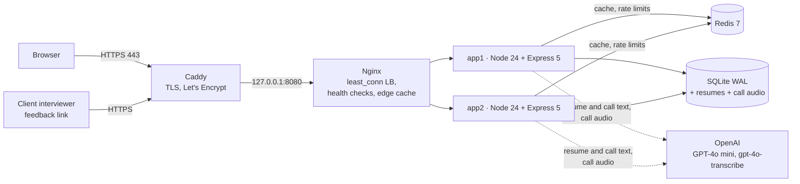
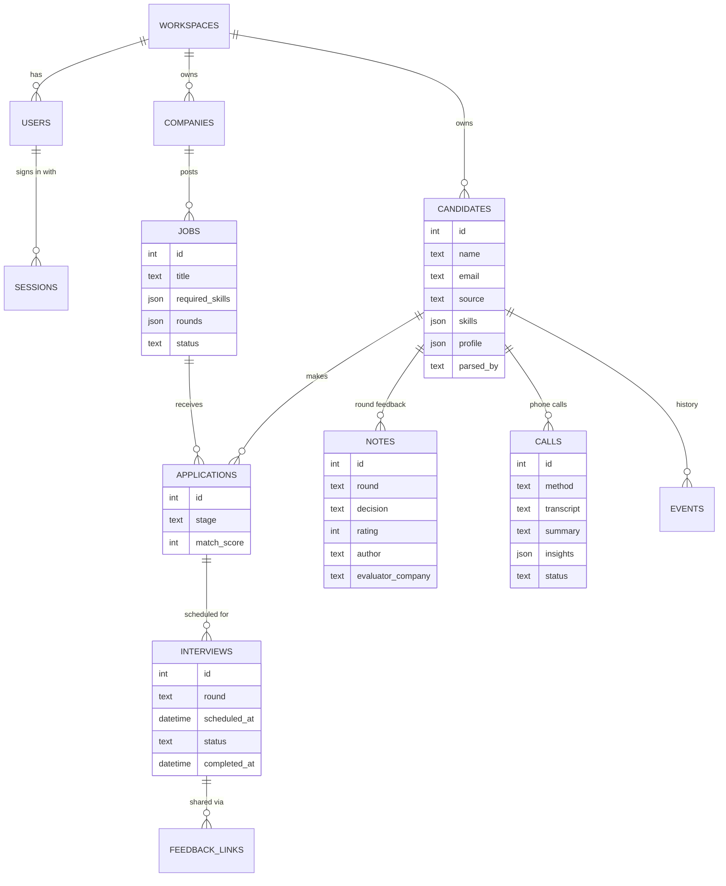

# T3Cogno Talent

**Applicant tracking for T3Cogno's talent acquisition practice.** Recruiters source candidates, call them, collect resumes, run each client's interview rounds and reuse past candidates for new openings, all in one private workspace.

**Live:** https://34-229-222-193.sslip.io  ·  Demo login on the sign-in page ("Explore the demo workspace")

Built for **[T3Cogno](https://www.t3cogno.com/)**, an HR services and outsourced-CHRO partner that hires for 100+ client companies across healthcare, startups and product companies. This is the first module of a full HR suite (see [Roadmap](#roadmap)).

---

## Contents

- [What it does](#what-it-does)
- [Features](#features)
- [The screens](#the-screens)
- [Architecture](#architecture)
- [Tech stack](#tech-stack)
- [Data model](#data-model)
- [API](#api)
- [Security and privacy](#security-and-privacy)
- [Run it locally](#run-it-locally)
- [Deploy](#deploy)
- [Configuration](#configuration)
- [Tests](#tests)
- [Project structure](#project-structure)
- [Roadmap](#roadmap)
- [Team](#team)

---

## What it does


1. **Add the candidate.** Upload a resume (PDF, Word or text) and record where the candidate came from. GPT-4o mini reads the whole resume for any profession (nurse, accountant, sales executive, engineer...).
2. **Capture the call.** Record the phone call live in the browser (speakerphone), upload a recording from the phone, or type notes. The call is transcribed and the AI fills in salary, notice period, availability, interest and concerns.
3. **Run the client's process.** Every job defines its own interview rounds. Schedule each round with a date and time, mark it finished, and record the result.
4. **Collect the client's verdict.** The client's interviewer records feedback on the job's board, or through a one-time link that needs no account.
5. **Reuse the pool.** For every new job the app ranks the candidates you already have by skill match.

## Features

| Area | Features |
|---|---|
| **Accounts** | Email + password sign-up and sign-in, **Sign in with Google**, shared demo account, every account gets its own private workspace, new workspaces start empty, "Clear all workspace data" |
| **Resumes** | PDF / DOCX / TXT upload, **AI parsing with GPT-4o mini** (structured outputs) for any profession: summary, every job with dates and highlights, education, skills, tools, certificates and licences, projects, links, notice period, salary. Falls back to a rule-based parser. Returning candidates (same email) are updated, not duplicated |
| **Candidate source** | Naukri, LinkedIn, Indeed, Referral, Walk-in, Company website, Job fair, WhatsApp, Social media, Campus, Other, plus a free-text detail. Filter by source and see the breakdown on Home |
| **Calls** | **Live recording in the browser** (for phones that cannot record calls), **upload a phone recording** (m4a, mp3, amr, 3gp, wav, ogg, webm...) or **type notes**. Transcribed with `gpt-4o-transcribe`, summarised by GPT-4o mini into interest level, current and expected salary, notice period, joining date, location, availability, concerns, next steps and recruiter comments. Newer facts update the profile. Playback and full transcript kept |
| **Jobs** | Jobs per client company, required skills, **custom interview rounds per job** (one round or up to ten, any names), change rounds later |
| **Hiring board** | Columns follow each job's rounds, drag-and-drop, next interview shown on each card, **Rounds & feedback** panel per candidate |
| **Interviews** | Schedule with date, time, length, interviewer and place or meeting link; scheduling moves the candidate to that round; mark **finished** or **cancelled**; upcoming interviews on Home |
| **Feedback** | Result per round (**Passed / Not passed / On hold**), 1 to 5 rating, comments, evaluator and their company; suggests the next step; **one-time feedback link** for the client's interviewer |
| **Talent pool** | Search across names, skills and full resume text, filter by role, skill and source, **match %** suggestions for every job, CSV export |
| **Ease of use** | Plain-language labels, a help box on every page, **Guide me** spotlight tour across the whole workflow, step-by-step dialogs |
| **Platform** | HTTPS, Nginx load balancing over two app replicas, Redis caching and rate limits, per-workspace data isolation, 45 automated tests |

## The screens

| Screen | What you see | What you do |
|---|---|---|
| **Home** | Greeting, four counts (candidates, returning, open jobs, in progress), upcoming interviews, hiring funnel, where candidates come from, most common skills, roles, recent activity | See the day at a glance; click a count to drill in |
| **Candidates** | Everyone in your pool with role, experience, top skills, source, applications, last activity | Upload a resume, search, filter, export, open a profile |
| **Candidate profile** | Contact details, source, skills, AI-read summary, work history, education, certificates, links; jobs this person is in; interviews; calls; history | Add to a job, change their round, schedule interviews, add call details |
| **Jobs** | One card per opening with company, required skills and how many people are at each round | Create a job with its own rounds |
| **Hiring board** | One column per round of that job; candidate cards with match % and next interview; good matches from your pool on the right | Drag people forward, open **Rounds & feedback**, schedule, collect feedback, add pool matches |
| **Feedback link page** (public) | Candidate name, role, round and interview time only | The client's interviewer submits result, rating and comments |

**What the numbers mean:** *Candidates* = people added · *Returning* = applied again with the same email · *Open jobs* = openings still hiring · *In progress* = people not yet Hired or Rejected · *Match %* = share of the job's required skills the person has.

## Architecture



| Concern | Approach |
|---|---|
| **Availability** | Two stateless app replicas behind Nginx (`least_conn`, passive health checks, retry on failure). Rolling deploys: replace one replica while the other serves |
| **Performance** | Redis read-through cache per workspace, invalidated by a version bump before every write responds; Nginx caches hashed static assets for a year |
| **Multi-tenancy** | Every company, job and candidate belongs to a workspace. Requests run in an AsyncLocalStorage context and every query filters on the signed-in user's workspace. Cache keys include the workspace |
| **Abuse protection** | Rate limits in Redis shared by both replicas: sign-in and sign-up per IP, uploads and calls per user, feedback links per IP |
| **AI reliability** | Strict JSON-schema structured outputs, facts cross-checked against regex (emails must appear in the resume), never extracts protected attributes, rule-based fallback, background processing with retry for calls |
| **Degradation** | Redis down: cache bypassed. OpenAI down or no key: rule-based resume parser, call recordings and notes still saved |

Full details, verified failure tests and the scaling path: **[docs/ARCHITECTURE.md](docs/ARCHITECTURE.md)**.

## Tech stack

| Layer | Technology |
|---|---|
| Frontend | React 18, Vite, React Router, plain CSS (T3Cogno brand), MediaRecorder + Web Audio for live call recording |
| Backend | Node.js 24, Express 5 (ES modules), `node:sqlite`, multer, pdf-parse, mammoth |
| AI | OpenAI GPT-4o mini (structured outputs) for resumes and calls, `gpt-4o-transcribe` for call audio, ffmpeg for audio conversion |
| Auth | scrypt password hashes, HttpOnly session cookies, Google Identity Services |
| Data and cache | SQLite (WAL) on a Docker volume, Redis 7 (LRU, 64 MB) |
| Infrastructure | AWS EC2 (Ubuntu 24.04), Docker Compose, Nginx, Caddy (automatic HTTPS) |

## Data model



A job's pipeline is always `Applied → <the job's rounds> → Offer → Hired`, with `Rejected` available from any stage.

## API

All endpoints are under `/api`, JSON in and out, errors as `{ "error": "message" }`. Everything except auth, health and the public feedback form requires a session and only sees the caller's workspace.

| Area | Endpoints |
|---|---|
| Auth | `GET /auth/config` · `GET /auth/me` · `POST /auth/signup` · `POST /auth/login` · `POST /auth/google` · `POST /auth/logout` |
| Home | `GET /stats` · `GET /meta` · `GET /health` |
| Candidates | `GET /candidates?q=&role=&skill=&source=` · `POST /candidates/upload` · `GET/PATCH /candidates/:id` · `GET /candidates/:id/resume` · `GET /candidates/export.csv` · `POST /candidates/:id/notes` |
| Calls | `POST /candidates/:id/calls` (audio and/or notes) · `GET /calls/:id/audio` · `POST /calls/:id/retry` |
| Jobs | `GET/POST /jobs` · `GET/PATCH /jobs/:id` (incl. rounds) · `GET /jobs/:id/matches` · `GET/POST /companies` |
| Pipeline | `POST /applications` · `PATCH /applications/:id` (stage) |
| Interviews | `GET /interviews?upcoming=1` · `POST /interviews` · `PATCH /interviews/:id` · `POST /interviews/:id/feedback-link` |
| Public | `GET/POST /public/feedback/:token` |
| Workspace | `DELETE /workspace/data` (admin, typed confirmation) |

## Security and privacy

- Passwords hashed with salted scrypt; sessions are random tokens in HttpOnly, SameSite=Lax, Secure cookies, stored only as SHA-256.
- Every query is scoped to the signed-in user's workspace; automated tests check that one workspace cannot read or change another's data, including through the cache.
- Feedback links are single-use, expire after 21 days and show only the candidate's name, role and round.
- The AI is instructed never to extract age, date of birth, gender, marital status, religion, caste or health details.
- Resume text and call audio are sent to OpenAI only when `OPENAI_API_KEY` is set. Recruiters are reminded to tell candidates that calls are recorded.
- CSV export is protected against spreadsheet formula injection.

## Run it locally

Requirements: Node.js 22.13+ (24 recommended), and ffmpeg for call recordings.

```bash
npm run install:all
npm run dev:server          # API on http://localhost:4000 (creates the demo account)
npm run dev:client          # app on http://localhost:5173
```

Or the full production stack (Nginx, two replicas, Redis) with Docker:

```bash
docker compose up -d --build    # http://localhost
```

Demo login: `demo@t3hr.app` / `demo1234` (shown on the sign-in page).

## Deploy

The live server is an AWS EC2 instance with Caddy for HTTPS in front of the Docker Compose stack:

```bash
HTTP_BIND=127.0.0.1:8080 docker compose up -d --no-build
```

Rolling update: build the image, then recreate `app2`, wait until healthy, recreate `app1`, and reload Nginx. See [docs/ARCHITECTURE.md](docs/ARCHITECTURE.md).

## Configuration

Set in a `.env` file next to `docker-compose.yml` (see [server/.env.example](server/.env.example)):

| Variable | Purpose |
|---|---|
| `OPENAI_API_KEY` | Enables AI resume parsing and call transcription and summaries |
| `OPENAI_MODEL` | Model for resumes and calls (default `gpt-4o-mini`) |
| `OPENAI_TRANSCRIBE_MODEL` | Model for call audio (default `gpt-4o-transcribe`) |
| `GOOGLE_CLIENT_ID` | Enables Sign in with Google |
| `DEMO_PASSWORD` | Demo account password; empty disables the demo account |
| `HTTP_BIND` | Where Nginx listens (`127.0.0.1:8080` behind Caddy) |

## Tests

```bash
npm test        # 45 tests: parsing, AI parsing, auth, workspace isolation, cache, rate limits,
                # custom rounds, interviews, calls (ffmpeg + transcription), feedback links, CSV
```

## Project structure

```
client/                       React app
  src/pages/                  Landing, sign-in, Home, Candidates, Candidate profile, Jobs, Hiring board, public feedback page
  src/components/             Guide me tour, help boxes, call recorder, rounds editor, schedule dialog, feedback panel...
server/
  src/index.js                Express app, middleware order (auth, cache, routes)
  src/auth.js, context.js     Accounts, sessions, per-request workspace context
  src/services.js             Business logic (candidates, jobs, rounds, interviews, feedback)
  src/aiParser.js             GPT-4o mini resume parsing
  src/calls.js                Call audio, transcript, insights, profile update
  src/feedback.js             One-time feedback links
  src/cache.js, ratelimit.js, redis.js
  src/routes/                 REST endpoints
  test/                       node:test suites
deploy/nginx.conf             Load balancer
docker-compose.yml            Nginx + 2 app replicas + Redis
docs/ARCHITECTURE.md          Production architecture
```

## Roadmap

Mapped to T3Cogno's service lines:

| Phase | Module | T3Cogno service |
|---|---|---|
| 1 (this repo) | **ATS**: sourcing, calls, AI parsing, client rounds and feedback, talent pool | Talent Acquisition |
| 2 | **HRIS**: employee records, onboarding, leave and attendance, documents | HR Services |
| 3 | **Payroll and HR insights**: payroll runs, attrition and engagement early-warning signals, analytics | Payroll Services, CHRO advisory |

Next for the ATS: click-to-call through an Indian telephony provider (for example Exotel) with automatic recording, WhatsApp and email notifications to candidates and interviewers, team roles (recruiter and interviewer) inside a workspace, Postgres and S3 for scale.

## Team

| Area | Owner |
|---|---|
| Backend foundation, resume parser, deployment | [@Rohx24](https://github.com/Rohx24) |
| Frontend, accounts and workspaces, AI parsing, calls, rounds and interviews, feedback links, caching and load balancing | [@SushrithKbtech](https://github.com/SushrithKbtech) |
