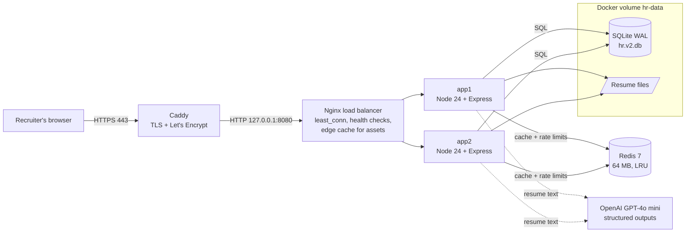

# T3Cogno Talent: production architecture

Live: https://34-229-222-193.sslip.io (AWS EC2, Ubuntu 24.04, t3.micro)

## 1. Request path



| Layer | What it does | Why |
|---|---|---|
| **Caddy** | Terminates HTTPS, renews the Let's Encrypt certificate, redirects HTTP to HTTPS | Free, automatic TLS with zero config |
| **Nginx** | Splits traffic between two app replicas (`least_conn`), skips a replica after 3 failures for 10 s, retries idempotent requests on the other replica, caches hashed JS/CSS for a year | No single app process is a point of failure; redeploys can drain one replica at a time |
| **app1 / app2** | Identical stateless Node processes (Express 5). Sessions live in the database, not in memory, so any replica can serve any user | Horizontal scaling |
| **Redis** | Read-through API cache and shared rate-limit counters | Faster pages, and limits that hold across replicas |
| **SQLite (WAL)** | Source of truth, shared by both replicas on one volume, `busy_timeout` 5 s | Zero-ops for a prototype; the SQL is portable to Postgres |
| **OpenAI GPT-4o mini** | Turns resume text into a detailed, schema-checked profile | Accurate parsing for any profession; falls back to the rule-based parser if unavailable |

## 2. Multi-tenancy (every user sees only their own data)

- `workspaces` → `users` (one workspace each) → `sessions` (random token in an HttpOnly, SameSite=Lax cookie; only its SHA-256 is stored).
- `companies`, `jobs` and `candidates` carry a `workspace_id`; applications, notes, events and interviews are reached through them.
- Every request after `requireAuth` runs inside an AsyncLocalStorage context holding the user's workspace, and every service query filters on it. Tests prove one workspace cannot read or change another's records.

## 3. Caching

- **What is cached:** reads such as `/stats`, `/candidates`, `/jobs/:id`, `/jobs/:id/matches`, `/meta`, `/interviews` (TTL 30 to 300 s).
- **Key:** `hr:ws:<workspaceId>:v<version>:<url>`, so a workspace can never receive another workspace's cached response.
- **Invalidation:** every successful write (POST/PATCH/PUT/DELETE) increments that workspace's version *before* the response is sent. The next read on any replica misses and rebuilds. Old keys are never read again and expire by TTL; Redis evicts with LRU under its 64 MB cap.
- **Failure mode:** if Redis is down, requests bypass the cache (`X-Cache: BYPASS`) and are served from SQLite. Nothing breaks.

## 4. Rate limiting

Fixed-window counters in Redis shared by both replicas (falls back to per-process memory if Redis is down):

| Endpoint | Limit |
|---|---|
| Sign in, sign up | 10 per IP per 15 min |
| Google sign-in | 20 per IP per 15 min |
| Resume upload (parsing is the most expensive call) | 30 per user per minute |

## 5. Observability

- `X-Served-By` (which replica), `X-Cache` (HIT / MISS / BYPASS), `X-Upstream` (Nginx's choice), `X-Edge-Cache` (static assets).
- `GET /api/health` returns `{ instance, cache: up|down|disabled, uptime_s }`; Docker health checks use it.
- Each API request is logged with method, path, status and latency.

## 6. Verified behaviour

| Scenario | Result |
|---|---|
| Six requests in a row | Alternate between app1 and app2 |
| app1 stopped | app2 serves everything; the site stays up |
| Redis stopped | Requests still succeed with `X-Cache: BYPASS`; cache resumes when Redis returns |
| 11 bad logins spread across both replicas | First 10 rejected with 401, 11th blocked with 429 (shared counter) |
| Write then read | The read after a write is always a cache MISS (fresh data) |

## 7. Scaling path

| Today | Next step |
|---|---|
| SQLite on one volume | Postgres (RDS) with read replicas; the SQL is already standard |
| Files on the volume | S3 with pre-signed URLs |
| Redis container | ElastiCache |
| Nginx on one EC2 | Application Load Balancer + Auto Scaling Group (the app is already stateless) |
| Parsing inside the request | SQS queue + worker for bulk uploads |

## 8. Running it

```bash
# local: full stack on http://localhost
docker compose up -d --build

# EC2: Caddy already listens on 80/443 and proxies to 127.0.0.1:8080
HTTP_BIND=127.0.0.1:8080 docker compose up -d
```

Settings (in a `.env` file next to `docker-compose.yml`): `GOOGLE_CLIENT_ID`, `OPENAI_API_KEY`, `OPENAI_MODEL` (default `gpt-4o-mini`), `DEMO_PASSWORD`, `HTTP_BIND`.
