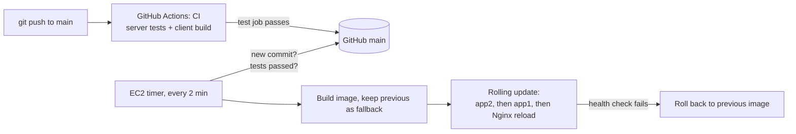

# Deployment

**Push to `main` and it goes live.** Nobody needs server access to ship an update.



1. Every push and pull request runs **CI** (`.github/workflows/ci.yml`): the server test suite and a client production build.
2. On the server, `hr-deploy.timer` runs `/usr/local/bin/hr-deploy` every 2 minutes. It reads the latest commit on `main` and asks GitHub whether that commit's `test` job passed.
3. If it passed and is not live yet: clone that commit, build the Docker image (the current image is kept as `hr-int:previous`), sync `docker-compose.yml` and `deploy/nginx.conf`, then replace `app2`, wait until healthy, replace `app1`, wait until healthy, reload Nginx. The site stays up throughout.
4. If a replica does not become healthy, the previous image is restored and that commit is not retried. Push a fix to try again.
5. Failed tests on GitHub mean nothing is deployed.

**Which version is live?** `https://34-229-222-193.sslip.io/api/health` returns `"version"`, the short commit hash. It usually updates 3 to 7 minutes after a push (CI, then the next timer tick, then the build).

## Why the server pulls instead of GitHub pushing

- SSH on the instance is open only to the owner's IP; nothing extra had to be opened.
- No server keys are stored in GitHub, and the public repo needs no credentials to clone.
- The deploy script lives outside the repo (root-owned), so changing code cannot change how deploys work.

## Manual "deploy now" (restricted key)

Trusted maintainers can have a key in `/home/deployer/.ssh/authorized_keys` (root-owned) locked to the deploy script:

```
restrict,command="sudo -n /usr/local/bin/hr-deploy" ssh-ed25519 AAAA... name
```

`restrict` disables the terminal, port forwarding and agent forwarding; the forced command ignores anything typed after the ssh command; `deployer` may only run that one script through sudo. Running `ssh -i <key> deployer@<server>` triggers the same deploy as the timer. It requires the security group to allow SSH from that person's IP.

## Server files

| File | Installed at |
|---|---|
| `deploy/hr-deploy.sh` | `/usr/local/bin/hr-deploy` (root, 755) |
| `deploy/hr-deploy.service`, `deploy/hr-deploy.timer` | `/etc/systemd/system/` |
| state (live / failed commit, lock) | `/var/lib/hr-deploy/` |
| secrets (`OPENAI_API_KEY`, `GOOGLE_CLIENT_ID`, `HTTP_BIND`) | `/home/ubuntu/T3-HR-Solutions/.env` (never overwritten by deploys) |

Logs: `sudo journalctl -u hr-deploy -n 50`.
