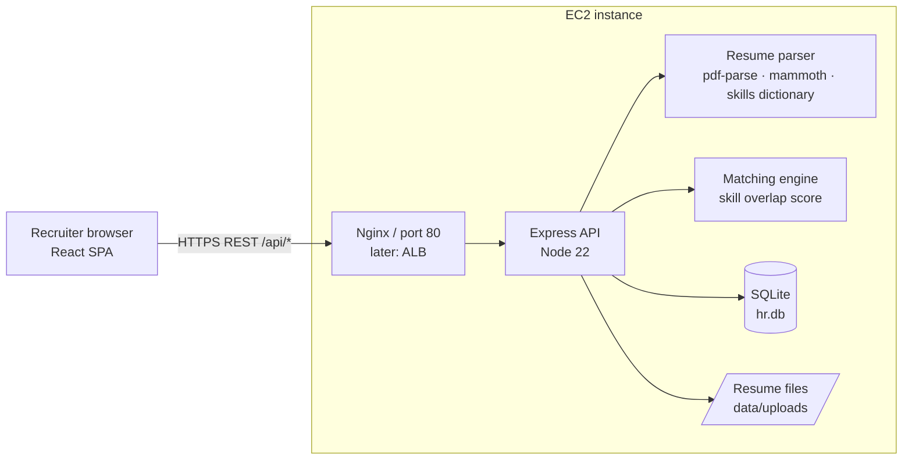
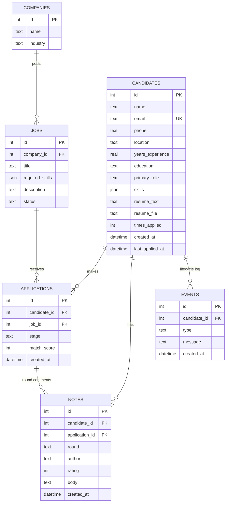
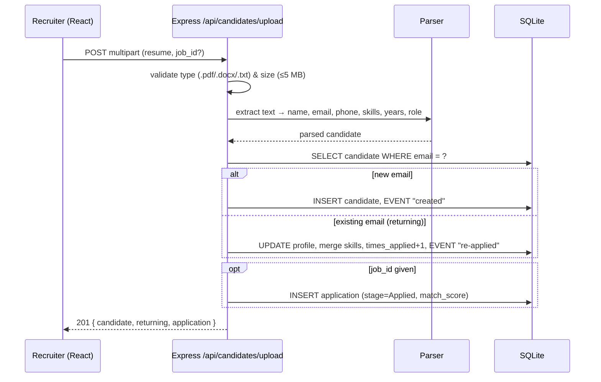
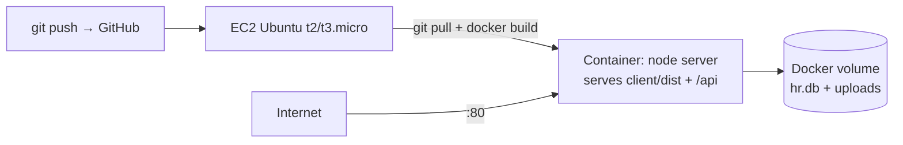

# HR-int: Prototype Plan (ATS baseline)

**Today:** ship a live link showing a working full-stack **ATS (Applicant Tracking System)**.
**Internship (3 months):** grow it into a full **HRIS** (HR Information System).

---

## 1. What the prototype does (from the CEO call)

1. **Upload resume** (PDF / DOCX / TXT). The app parses name, email, phone, location, skills, years of experience, education and **primary role** (e.g. *Java Developer*, *Python Developer*).
2. **Candidate pool**: every parsed candidate is saved in one database. Recruiters search and filter by skill, role or free text.
3. **Interview rounds + comments**: recruiters move a candidate through stages and add a **comment + rating after every round**.
4. **Returning candidates**: when the same email applies again (e.g. 1–2 years later), the existing profile is **updated, not duplicated**. The old history is kept and the profile shows a "Returning" badge.
5. **Reuse for another company**: each job (per client company) shows **ranked matches from the existing pool**, so a past candidate can be pitched to a new company.

**Out of scope today:** login/roles, AI/LLM parsing, emails, scheduling, payroll (see Roadmap).

---

## 2. Tech stack (both of us use exactly this)

| Layer | Choice | Notes |
|---|---|---|
| Runtime | **Node.js 22+** | `node -v` must be ≥ 22. We use the built-in `node:sqlite`, so there's nothing native to compile |
| Backend | **Express 5** (ES modules) | REST/JSON under `/api/*` |
| Uploads | **multer** | 5 MB limit; `.pdf .docx .txt` only |
| Parsing | **pdf-parse** (PDF), **mammoth** (DOCX) | + our own skills dictionary / regex extractor |
| Database | **SQLite** via `node:sqlite` | single file `server/data/hr.db`. Swap to Postgres (RDS) later |
| Frontend | **React 18 + Vite** (JavaScript, JSX) | `react-router-dom` for pages |
| Styling | **Plain CSS** (`client/src/styles.css`) | no UI library, so zero setup |
| HTTP client | `fetch` wrapper in `client/src/api.js` | no axios needed |
| Hosting | **AWS EC2** (Ubuntu) + **Docker** | one container, port 80 |

---

## 3. Repo layout

```
HR-int/
├── docs/PLAN.md            ← this file
├── package.json            ← root scripts: build (client) + start (server)
├── Dockerfile              ← builds client, runs server            [Rohit]
├── deploy/ec2-setup.sh     ← one-shot EC2 install + run            [Rohit]
├── samples/                ← sample resumes for the demo           [Rohit]
├── server/                                                         [Rohit]
│   ├── package.json
│   ├── data/               ← hr.db + uploads/ (git-ignored)
│   └── src/
│       ├── index.js        ← Express app, serves API + client/dist
│       ├── db.js           ← schema + seed
│       ├── parser.js       ← resume text → structured candidate
│       ├── skills.js       ← skills dictionary + role rules
│       ├── matching.js     ← job ↔ candidate match score
│       └── routes/         ← candidates, jobs, companies, applications, stats
└── client/                                                         [Sushrith]
    ├── package.json
    ├── vite.config.js      ← proxy /api → http://localhost:4000
    ├── index.html
    └── src/
        ├── main.jsx, App.jsx, api.js, styles.css
        ├── components/     ← Sidebar, StageBadge, SkillChips, UploadResume, ...
        └── pages/          ← Dashboard, Candidates, CandidateDetail, Jobs, JobDetail
```

---

## 4. System design

### 4.1 High-level architecture



**Pattern:** a *modular monolith*. There is one deployable unit, but parser, matching, and each resource's routes are separate modules, so each can later be split into its own service (e.g. the parser becomes a worker) without rewriting.

**Why this shape for the baseline**
- **One container, one port:** Express serves the built React app *and* the API from the same origin, so there's no CORS and no second server to host.
- **SQLite:** zero setup and a single file to back up. The SQL is plain enough to move to Postgres unchanged.
- **Deterministic parser (no LLM yet):** free, instant, works offline, and the result is explainable to a recruiter ("matched: Java, Spring Boot").

### 4.2 Data model (ER)



- `candidates.email` is **UNIQUE**: that's the dedupe key for returning candidates.
- `applications (candidate_id, job_id)` is **UNIQUE**, so a candidate can't be added to the same job twice.
- Notes hang off the **candidate** (so they survive across jobs/companies) and optionally an **application** (which job/round they were for).
- `events` is an append-only lifecycle log: created → re-applied → stage changes → notes.

**Stages:** `Applied → Screening → Technical → HR Round → Offer → Hired`, or `Rejected` from any stage.

### 4.3 Key flow: resume upload + dedupe



### 4.4 Parsing approach (`parser.js` + `skills.js`)
- **Text:** `pdf-parse` for PDF, `mammoth` for DOCX, raw for TXT.
- **Email / phone:** regex. **Name:** the first short line of letters that isn't a heading like "Resume".
- **Skills:** a dictionary of ~100 skills with aliases (e.g. `springboot`, `spring boot` → **Spring Boot**), matched case-insensitively on word boundaries (so "Java" ≠ "JavaScript").
- **Years of experience:** the largest `N years / N+ yrs` found (capped at 40).
- **Primary role:** score role profiles (Java Developer, Python Developer, Frontend, Full Stack, Data Scientist, DevOps, Mobile, QA) by skill hits and pick the highest.

### 4.5 Matching (`matching.js`)
`match_score = round(100 × |candidate.skills ∩ job.required_skills| / |job.required_skills|)`, and the endpoint returns `matched_skills` and `missing_skills` so the score explains itself. Candidates already in that job's pipeline are excluded from suggestions.

### 4.6 Deployment


- Security group: inbound **22** (your IP only) and **80** (anyone). Data lives in a Docker volume, so it survives redeploys.
- Redeploy = `git pull && docker build -t hr-int . && docker rm -f hr && docker run -d --name hr -p 80:4000 -v hrdata:/app/server/data hr-int`.

### 4.7 Scaling path (what we'd say in an interview)

| Bottleneck | Baseline | Next step |
|---|---|---|
| DB | SQLite file | **Postgres on RDS** (same SQL), full-text search on resumes |
| Files | local disk | **S3** + pre-signed URLs |
| Parsing | in the request | **SQS queue + worker** (bulk uploads, LLM parsing) |
| App | 1 EC2 | **ALB + Auto Scaling Group** (app is stateless once DB/files move out) |
| Security | none | **JWT auth + roles** (Admin / Recruiter / Interviewer), HTTPS via ACM, audit log, PII encryption |
| Ops | logs on box | CloudWatch logs + alarms, `/api/health` for ALB checks |

---

## 5. REST API contract (agree on this first, then build in parallel)

Base URL: `/api`. JSON in and out. Errors always look like `{ "error": "message" }` with a 4xx/5xx status.

| Method | Path | Body / Query | Returns |
|---|---|---|---|
| GET | `/health` | | `{ "ok": true }` |
| GET | `/meta` | | `{ stages[], roles[], skills[] }` for dropdowns |
| GET | `/stats` | | dashboard object (below) |
| GET | `/candidates` | `?q=&skill=&role=` | `Candidate[]` |
| POST | `/candidates/upload` | multipart: `resume` (file), `job_id` (optional) | `201 { candidate, returning, application }` |
| GET | `/candidates/:id` | | `CandidateDetail` |
| GET | `/candidates/:id/resume` | | original file download |
| POST | `/candidates/:id/notes` | `{ application_id?, round, author, rating, body }` | `201 Note` |
| GET | `/companies` | | `Company[]` |
| POST | `/companies` | `{ name, industry }` | `201 Company` |
| GET | `/jobs` | | `Job[]` (with stage counts) |
| POST | `/jobs` | `{ company_id, title, required_skills: string[], description }` | `201 Job` |
| GET | `/jobs/:id` | | `JobDetail` (pipeline) |
| GET | `/jobs/:id/matches` | | `Match[]` (sorted by score desc) |
| POST | `/applications` | `{ candidate_id, job_id }` | `201 Application` (`409` if already in pipeline) |
| PATCH | `/applications/:id` | `{ stage }` | `Application` |

### Response shapes (use these as mock data until the backend is up)

**Candidate** (list item)
```json
{
  "id": 1,
  "name": "Priya Sharma",
  "email": "priya.sharma@example.com",
  "phone": "+91 98450 12345",
  "location": "Bengaluru",
  "years_experience": 4,
  "education": "B.Tech",
  "primary_role": "Java Developer",
  "skills": ["Java", "Spring Boot", "MySQL", "AWS", "Docker"],
  "times_applied": 2,
  "application_count": 1,
  "created_at": "2024-08-12T10:00:00.000Z",
  "last_applied_at": "2026-10-01T09:30:00.000Z"
}
```
Show a **"Returning"** badge when `times_applied > 1`.

**CandidateDetail** = Candidate + :
```json
{
  "resume_text": "Priya Sharma\nBengaluru ...",
  "has_resume_file": true,
  "applications": [
    { "id": 3, "job_id": 1, "job_title": "Senior Java Developer", "company_name": "Acme Fintech",
      "stage": "Technical", "match_score": 80, "created_at": "2026-10-01T09:30:00.000Z" }
  ],
  "notes": [
    { "id": 5, "application_id": 3, "job_title": "Senior Java Developer", "round": "Technical",
      "author": "Rohit", "rating": 4, "body": "Strong Spring Boot, weak on Kafka.", "created_at": "2026-10-01T10:00:00.000Z" }
  ],
  "events": [
    { "id": 9, "type": "reapplied", "message": "Returning candidate: resume re-parsed (first seen Aug 2024)", "created_at": "2026-10-01T09:30:00.000Z" }
  ]
}
```

**Upload response**
```json
{ "candidate": { "...CandidateDetail": "" }, "returning": true, "application": null }
```

**Job** (list item)
```json
{
  "id": 1, "company_id": 1, "company_name": "Acme Fintech",
  "title": "Senior Java Developer",
  "required_skills": ["Java", "Spring Boot", "Microservices", "SQL", "AWS"],
  "description": "Payments platform team.", "status": "open",
  "created_at": "2026-09-20T09:00:00.000Z",
  "total": 4,
  "stage_counts": { "Applied": 1, "Screening": 1, "Technical": 1, "HR Round": 0, "Offer": 1, "Hired": 0, "Rejected": 0 }
}
```

**JobDetail** = Job + :
```json
{
  "applications": [
    { "id": 3, "stage": "Technical", "match_score": 80, "created_at": "2026-10-01T09:30:00.000Z",
      "candidate": { "id": 1, "name": "Priya Sharma", "primary_role": "Java Developer",
                     "years_experience": 4, "skills": ["Java", "Spring Boot"], "times_applied": 2 } }
  ]
}
```

**Match**
```json
{
  "candidate": { "id": 6, "name": "Karthik Rao", "primary_role": "Java Developer", "years_experience": 6,
                 "skills": ["Java", "Spring Boot", "Kafka"], "times_applied": 1, "last_applied_at": "2025-03-02T08:00:00.000Z" },
  "match_score": 60,
  "matched_skills": ["Java", "Spring Boot", "Microservices"],
  "missing_skills": ["SQL", "AWS"]
}
```

**Company:** `{ "id": 1, "name": "Acme Fintech", "industry": "Fintech", "job_count": 1 }`

**Stats**
```json
{
  "totals": { "candidates": 9, "returning": 2, "open_jobs": 3, "active_applications": 7, "hired": 1 },
  "funnel": [ { "stage": "Applied", "count": 3 }, { "stage": "Screening", "count": 2 } ],
  "top_skills": [ { "skill": "Python", "count": 4 } ],
  "roles": [ { "role": "Java Developer", "count": 3 } ],
  "recent_events": [ { "id": 9, "candidate_id": 1, "candidate_name": "Priya Sharma", "type": "reapplied",
                        "message": "Returning candidate: ...", "created_at": "2026-10-01T09:30:00.000Z" } ]
}
```

**Meta**
```json
{ "stages": ["Applied","Screening","Technical","HR Round","Offer","Hired","Rejected"],
  "roles": ["Java Developer","Python Developer","Frontend Developer","Full Stack Developer","Data Scientist","DevOps Engineer","Mobile Developer","QA Engineer"],
  "skills": ["AWS","Docker","Java"] }
```

---

## 6. Frontend spec (Sushrith)

**Routes** (`react-router-dom`)
| Route | Page | Must show |
|---|---|---|
| `/` | Dashboard | 4 stat cards (candidates, returning, open jobs, active applications); stage funnel (horizontal bars); top skills; recent activity feed |
| `/candidates` | Candidate pool | **Upload resume** button → drag-and-drop / file picker (+ optional "apply to job" dropdown), success toast says *"New candidate"* or *"Returning candidate updated"*; search box (`q`), role dropdown, skill dropdown; table: name + Returning badge, role, years, top 4 skill chips, applications, last active |
| `/candidates/:id` | Candidate profile | header (name, role, email, phone, location, years, education); skill chips; **Applications** (job · company · stage dropdown → PATCH); "Add to job" dropdown → POST /applications; **Round comments**: form (application, round, rating 1–5, author, comment) + timeline of notes & events; collapsible resume text + "Download original" |
| `/jobs` | Jobs | job cards (title, company, required skills, total + stage counts); **New job** form (company dropdown or "+ new company", title, comma-separated skills, description) |
| `/jobs/:id` | Job pipeline | **Kanban**: one column per stage, candidate cards (name, role, match %); move with a stage dropdown on each card (drag-and-drop is a bonus); right panel **"Suggested from talent pool"** → `/jobs/:id/matches` with match %, matched/missing skills, "Add to pipeline" button |

**Layout:** left sidebar (logo "HR-int", links: Dashboard, Candidates, Jobs), main content on the right. Neutral background, white cards, one accent colour (indigo `#4f46e5`). Stage colours: Applied grey, Screening blue, Technical violet, HR Round amber, Offer teal, Hired green, Rejected red.

**`client/src/api.js`**: all requests go to relative `/api/...`; on a non-2xx response throw `new Error(body.error)`.

**Setup**
```bash
npm create vite@latest client -- --template react
cd client && npm install && npm install react-router-dom
```
`client/vite.config.js`:
```js
import { defineConfig } from 'vite'
import react from '@vitejs/plugin-react'
export default defineConfig({
  plugins: [react()],
  server: { proxy: { '/api': 'http://localhost:4000' } },
})
```
Run the backend locally: `cd server && npm install && npm run dev` (port 4000), then `cd client && npm run dev` (port 5173).

---

## 7. Work split

### Rohit: Backend + Deployment (`server/`, `Dockerfile`, `deploy/`, `samples/`)
- [ ] Express app, `node:sqlite` schema, seed data (3 companies, 3 jobs, ~8 candidates incl. 1 "returning" from 2024, notes, events)
- [ ] Resume parser + skills dictionary + role detection
- [ ] Dedupe by email (returning-candidate merge + event)
- [ ] All endpoints in §5 + match scoring
- [ ] Serve `client/dist` in production; root `npm run build` / `npm start`
- [ ] Dockerfile + `deploy/ec2-setup.sh`; deploy to EC2; smoke test

### Sushrith: Frontend (`client/`)
- [ ] Vite + React app shell, sidebar, routing, `api.js`, `styles.css`
- [ ] Dashboard
- [ ] Candidate pool + upload
- [ ] Candidate profile + round comments
- [ ] Jobs list + new job form
- [ ] Job pipeline kanban + talent-pool suggestions

### Git workflow
- Rohit only touches `server/`, root files, `deploy/`, `samples/`. Sushrith only touches `client/`, so there are no merge conflicts.
- Commit small, `git pull --rebase` before every `git push` to `main`.
- If the contract has to change, update this doc in the same commit and tell the other person.

---

## 8. 30-minute timeline

| Time | Rohit | Sushrith |
|---|---|---|
| 0–5 | Read the contract (§5) | Read the contract (§5), scaffold Vite app |
| 5–20 | Server, DB, parser, endpoints → push | Pages using the §5 JSON as mock data |
| 20–25 | Help integrate, fix contract mismatches | Pull, run backend locally, remove mocks |
| 25–30 | Deploy to EC2, smoke test | Demo walkthrough, send link |

---

## 9. Demo script (2 minutes)

1. **Dashboard**: pool size, funnel, top skills, live activity.
2. **Upload a new resume** (`samples/`): parsed skills & role appear instantly.
3. **Upload a resume for an existing candidate**: *"Returning candidate"*, profile updated, history kept.
4. **Open a job → pipeline**: move a candidate to *Technical* and add a round comment with a rating.
5. **"Suggested from talent pool"**: reuse a candidate from a past job for a different company.
6. Close with the roadmap slide: ATS → HRIS → early-warning signals.

---

## 10. 3-month roadmap (ATS → HRIS)

- **Month 1, ATS hardening:** login + roles (Admin / Recruiter / Interviewer), LLM-based resume parsing, Postgres (RDS) + S3, email notifications, interview scheduling, bulk upload via queue.
- **Month 2, HRIS core:** *Hired* candidate becomes an employee record, onboarding checklists, leave & attendance, document vault.
- **Month 3, Insights:** early-warning signals (attrition / engagement risk), HR analytics dashboards, integrate the CEO's existing early-warning module.
